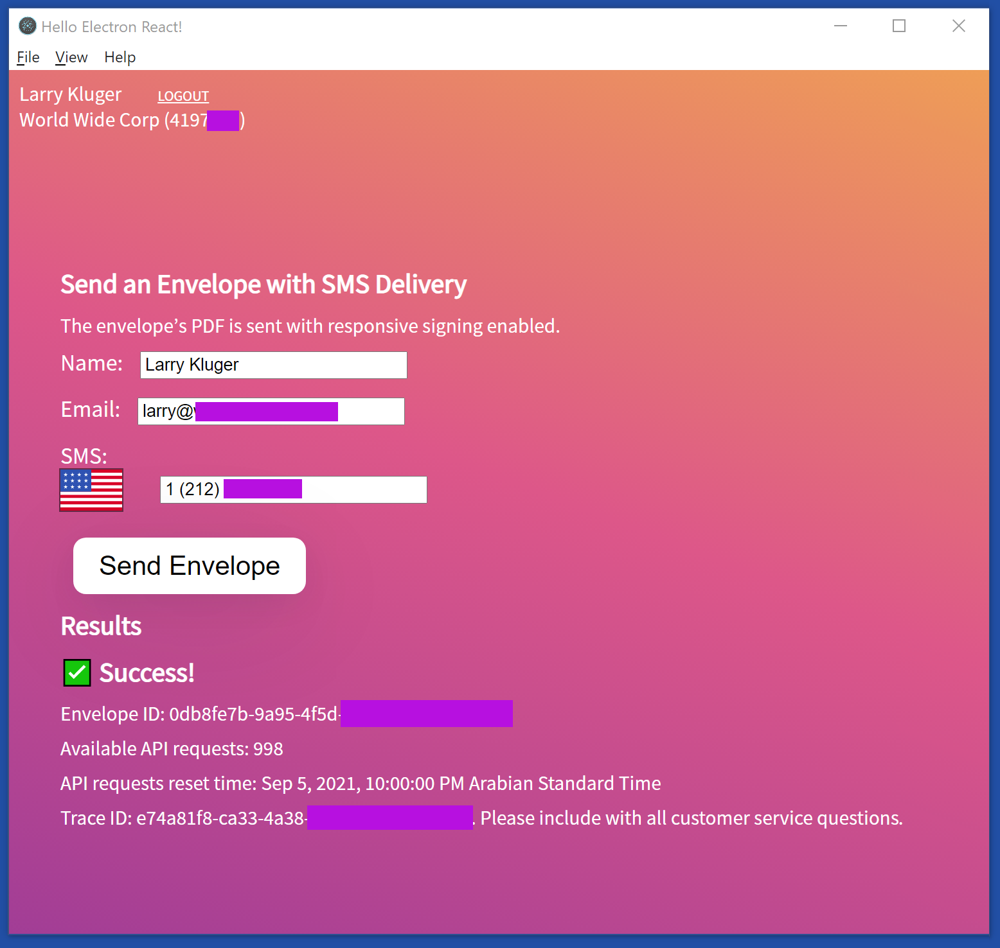

# Electron React Boilerplate DocuSign



This repo is a fork of the [electron-react-boilerplate](https://github.com/electron-react-boilerplate/electron-react-boilerplate) project, version 3.0.2,
with the addition of OAuth Implicit grant support
and a DocuSign eSignature API example.

This repo is the source code for the DocuSign Developer blog post 
**[Electron React apps with Implicit Grant](https://www.docusign.com/blog/developers/electron-react-apps-implicit-grant)**

## Installation

### Prerequistes
* Node v14
* Yarn v1.22.5 or later
* Tested with MacOS 11.5.2 and Windows 10
* DocuSign eSignature Developer account (free).
  To use the code example as is, you must request to have the
  **SMS Send** feature added to your developer account. 
  Use the [Customer Support portal](https://support.docusign.com/en/contactSupport) to open a case with
  your request. Use the **DocuSign API's Integration Support** option
  at the bottom of the page.

### Installing
* Clone this repo or download the zip file.
* cd to the project directory
* run command `yarn`
* copy the html file assets/public_thank_you/thankyou.html to a file server
that will be accessible to your application's users. (I.E. the file 
does not need to be available on the public Internet.) If desired, 
you can use the 
[GitHub wiki system](https://docs.github.com/en/communities/documenting-your-project-with-wikis/about-wikis) 
to publish the thankyou.html file.

### Configuration
* create a client id (an integration key) by using your DocuSign Developer account.
The client id must be configured for:

   * Implicit grant

   * Redirect URI: the URL for the thankyou.html file

   * Note: a client id secret is not used for the Implict grant flow
* copy file src/config_example.js to file src/config.js and update it:

  * First, decide what the application's [**private-use URI scheme**](https://datatracker.ietf.org/doc/html/rfc7595#section-3.8) 
     will be.
     The example uses a default value of `com.example.electron`
     in the reversed domain name-style recommended by [RFC 8252 §7.1](https://datatracker.ietf.org/doc/html/rfc8252#section-7.1).

     **Please do not use the default!** 

     Configure your private-use URI scheme in three places: the config.js
     file (`schemeName` setting), in the thankyou.html JavaScript code, 
     and in the /assets/info.mac.plist file

  * Update the config.js settings:  
  
  * `implicitClientId`: Set it to your client id

  * `implicitRedirectUrl`: Set it to the URL for the thankyou.html file
  
  * `tempAccessToken`: Only set this value if you are developing on a
    Mac. On the MacOS, the private-use URI scheme only works when
    the application is packaged and the scheme is requested in the
    plist file. Therefore, the Implicit grant authentication 
    flow fails during development on MacOS. To solve this 
    problem, set the `tempAccessToken` value to a current
    access token to skip the authentication step during development
    on MacOS. You can obtain an access token from the 
    [DocuSign Hackathon Access Token generator](https://developers.docusign.com/token-generator/).

  * The other settings in config.js can be left with their default settings.

## Starting Development

Start the app in the `dev` environment:

```bash
yarn start
```

## Packaging for Production

To package apps for the local platform:

```bash
yarn package
```
An installation file will be created in the /build/release directory.
On MacOS, a .dmg installation file is created. For Windows, a setup .exe 
file is created. See the [electron-builder](https://www.electron.build/)
for more information.

### More information
More information is available from the ReadMe of the 
[electron-react-boilerplate](https://github.com/electron-react-boilerplate/electron-react-boilerplate) project and
from the Electron documentation.

## Maintenance and Pull Requests
This repo is provided for use with the blog post 
and is not actively maintained. 

Pull Requests are welcomed if they use the MIT License. 

To use the most recent version of the electron-react boilerplate repo,
port the 
[OAuth and DocuSign commits](https://github.com/docusign/electron-react-boilerplate-docusign/commit/baef83879aadc7a6e02043c711191c5023b3f6b3)
to the current version
of the [boilerplate](https://github.com/electron-react-boilerplate/electron-react-boilerplate) repo.

